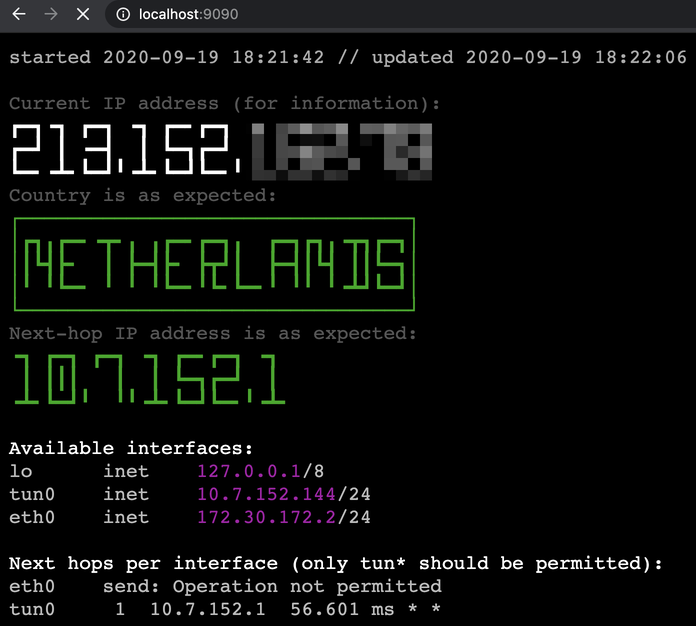
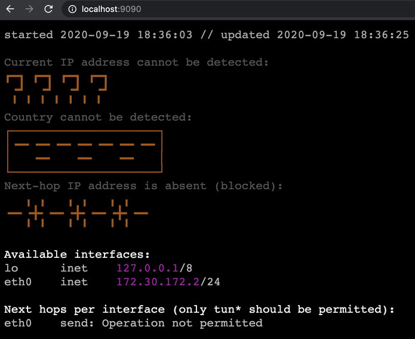
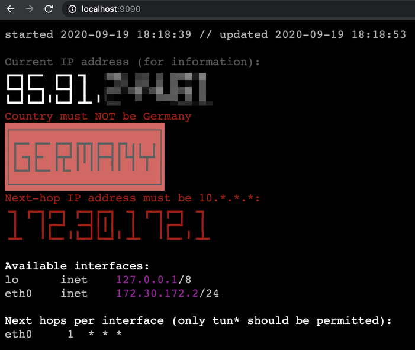

# VPN-in-Docker with a network lock

It is organized as a collection of containers, each doing its job:

* **Network** — a shared networking/firewalling namespace for all containers. 
* **OpenVPN** — tunnels the traffic through VPN (openvpn-client).
* **Firewall** — blocks the untunnelled traffic with a firewall (iptables).
* **RuleMaker** — generates the firewall rules to be applied atomically.
* **Status** — monitors the status of the setup and prints it to stdout.
* **WebView** — publishes the monitor's status via HTTP (static nginx).

Any amount of other containers can be added to run arbitrary application:

* **Transmission** — run securely as a sample application.

All components are optional and can be disabled. Though, without some of them, the solution makes no sense and will not function (the traffic will be blocked, or the apps will never start).

The setup does not affect other containers or applications running in the same Docker.

Only IPv4 addresses and traffic are currently supported. IPv6 is disabled and blocked.

[AirVPN](https://airvpn.org/) is used as a VPN provider, but any other OpenVPN-compatible one can be used (if you have a config file for OpenVPN and know their IP ranges for monitoring/alerting).


## Usage

To start:

```shell script
docker-compose build
docker-compose up
```

Then, open:

* http://localhost:9090/
* http://localhost:9091/

Or download and install [transmission-remote-gui](https://github.com/transmission-remote-gui/transgui) and configure a connection with `localhost` as the hostname.

Download [Ubuntu via BitTorrent](https://ubuntu.com/download/alternative-downloads) (either server or desktop, any version).

Stop with Ctrl+C (docker-compose will stop the containers).

To clean it up:

```shell script
docker-compose down --volumes --remove-orphans
```


## Monitoring

When the network is fully secured, you will see this status:

* The VPN's detected country is in green (acceptable).
* The default next-hop IP address is in green (acceptable).
* `eth*` interfaces show "Operation not permitted".
* `tun*` interfaces show some pinging and timing.



---

When VPN is down, but the traffic is still secured:

* The VPN's detected country is absent (acceptable).
* The default next-hop IP address is absent (acceptable).
* `eth*` interfaces show "Operation not permitted".
* `tun*` interfaces are absent.



To simulate:

```shell script
docker-compose stop openvpn
```

To restore:

```shell script
docker-compose start openvpn 
```

---

When the network is exposed, the status reporting looks like this:
 
* The VPN's detected country is in red and flashing (compromised).
* The default next-hop IP address is in red (compromised).
* `eth*` interfaces show some pinging and timing (they must not).
* `tun*` interfaces are either absent or show something.



To simulate:

```shell script
docker-compose stop openvpn firewall
docker-compose exec network iptables -F
docker-compose exec network iptables -P INPUT ACCEPT
docker-compose exec network iptables -P OUTPUT ACCEPT
```

To restore:

```shell script
docker-compose start openvpn firewall
```

Please note that to expose yourself, you need to do both: configure the firewall to pass the traffic **AND** shut down the VPN connection. As long as the VPN connection is alive, the traffic goes through it even if the firewall is in the permissive mode.


## Implementation details

### Shared network container

All of the containers use the shared network space of a special pseudo-container: it sleeps forever, and is only used as a shared network namespace with iptables.

**Why not Docker networks?** In that case, each container has its own iptables namespace, and so the firewall rules do not apply to all of them equally. With the shared container's network, they all run in the same networking context.
